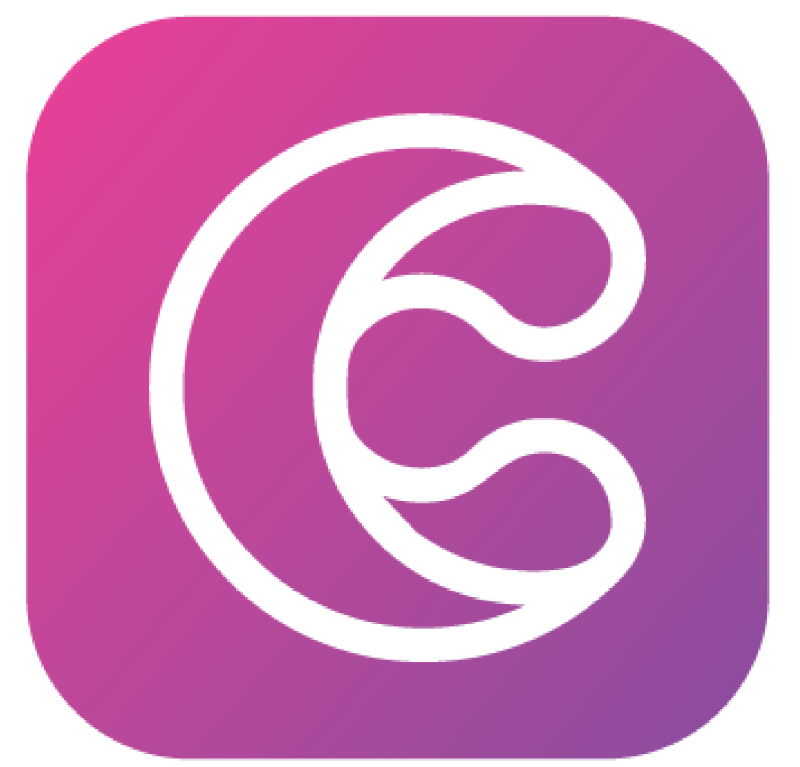

  
<h1  align="center" style="text-align: center;"><strong> Código Hub
 </strong></h1>

&nbsp;

## Project Overview

[Código](https://codigo-hub.com/) is a firmware distribution service built on top of the Ethereum blockchain and IPFS. Código natively allows developers to upload firmware for different devices and provides rudimentary search capabilities for users. Users can download firmware either by requesting a specific firmware image from a known developer or utilising a built-in web of trust model to automatically select a trusted developer.

This project aims to produce a DApp front end driver for Código, called Código Hub, to make it easier for developers to manage the firmware they upload to the network and for users to discover new firmware for their devices.

For developers we provide a convenient UI for viewing previously uploaded firmware, Filecoin integration for friction-less persistence on IPFS and a bounty system which rewards developers with ETH for filling unmet needs in the IoT domain.

For users we provide a graphical method for searching all firmware available on the network, automatic firmware deployment via MQTT (for supported devices), a reputation system to help users make trust decisions about individual firmware or developers, and the bounty system which allows users to offer ETH in return for novel features.

[Código Hub](https://codigo-hub.com/)  is built using React.js, Redex, Redux Persist and 3box. Intergration with several custom Ethereum 1.0 smart contracts is provided by Metamask. Filecoin and IPFS integration is provided by the Textile Powergate Javascript library and a hosted Powergate instance provided by Textile. Websocket MQTT is used to communicate with and automatically deploy firmware to compatible devices.

A full specification can be viewed online by clicking [here](https://github.com/ZeroSum24/Codigo-Hub/blob/master/specs/C%C3%B3digo%20Hub%20-%20Project%20Spec.pdf). 

## System Design Diagram

Código Hub incorporates almost all of the functionality outlined in this diagram. The network layer is based on the [Código Network](https://project-archive.inf.ed.ac.uk/msc/20182632/msc_proj.pdf) research project. Credit also to [CHAINIAC](https://www.usenix.org/conference/usenixsecurity17/technical-sessions/presentation/nikitin) for the distributed software verification components which are integratable with this project. Cumulatively, this design represents the current and future potential state of the Código project.

## [Demo Site & Video](https://codigo-hub.com/)

You can also demo the site by clicking [here](https://codigo-hub.com/), and view how it all works in the video [here](https://codigo-hub.com/).

## Technologies Used
* [React](https://reactjs.org/)+[Redux](https://redux.js.org/introduction/getting-started)  
* [Fleek](https://fleek.co/)  
* [Textile](https://textile.io/)  
* [Filecoin](https://filecoin.io/)  
* [Ethereum](https://ethereum.org/en/)  
* [MetaMask](https://metamask.io/)  
* [IPFS](https://ipfs.io/)  
* [3Box](https://3box.io/)  

Ethereum 1.0
Smart contracts for tracking users, bounties, available firmware
Allow developers to be paid in Ether for their contributions through donations or bounties
Filecoin to store firmware binaries and source code
Fleek to deploy our Dapp <--MISSING
Textile’s Powergate to interface with IPFS and Filecoin <--- MISSING
3box to manage decentralized user profiles and comments on firmware  ← MISSING
Websocket MQTT to communicate with constrained devices
## Developers

* **[Stephen Waddell](https://github.com/ZeroSum24)**  
* **[Michael Michaelides](https://github.com/michaelg9)**  
* **[Alex Shand](https://github.com/Alex-Shand)**  
* **[Mahbub Iftekhar](https://www.mahbubiftekhar.co.uk/)**  
* **[Bernard Choo](https://github.com/Bernardchoo)**  

## Future Work 

There are some improvements that could be made to app in the future:
* Inspect developer history on the Código Network using The Graph
* Use Unstoppable Domains to allow developers to add their crypto domain to their profile
* Stricter validation using user reputation, firmware metrics and CHAINIAC
moving instead to a system like fixed membership numbers

